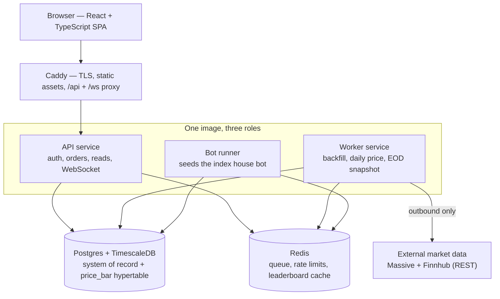
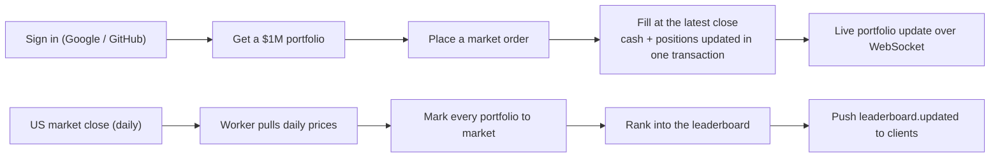

<p align="center">
  
</p>

# tickr

**A public stock-trading game.** Every player starts with **$1,000,000** in
virtual cash, trades real S&P 500 names against real market data, and competes
on a perpetual leaderboard. No real money is ever involved — it's a low-stakes,
fair, and genuinely fun way to play the market.

Market data (real-time quotes and two years of historical OHLCV bars) is pulled
from external REST providers, stored permanently in TimescaleDB, and used as the
single source of truth for every fill, valuation, and ranking.

> 🌐 **Landing page:** a richer HTML overview lives at
> [`docs/index.html`](docs/index.html). Enable GitHub Pages (deploy from branch
> → `/docs`) to publish it at `https://kgheacock.github.io/tickr/`.

---

## The game in one glance

| Rule                   | How v1 works                                                                       |
| ---------------------- | ---------------------------------------------------------------------------------- |
| **Starting capital**   | $1,000,000 virtual cash, same for everyone                                         |
| **Tradeable universe** | The full S&P 500 (~500 symbols)                                                    |
| **Order types**        | Market orders only, filled immediately                                             |
| **Fill price**         | The most recent end-of-day close from TimescaleDB                                  |
| **Leaderboard**        | One perpetual board, ranked by total equity (cash + positions)                     |
| **Ranking cadence**    | Refreshed once a day after the US market close                                     |
| **House bot**          | A built-in `index` bot holds an equal-weighted S&P 500 basket — a baseline to beat |
| **Sign-in**            | Google + GitHub SSO                                                                |

Because prices refresh once daily and orders fill at the latest close, there's no
intraday latency edge — everyone trades on the same information. The official
ranking moves once per day; the rest is strategy.

---

## Architecture

One Docker image ships three roles (`api`, `worker`, `bot`); a `ROLE` env var
selects which loop runs. The whole stack runs on a single VPS via Docker Compose.



- **Caddy** terminates TLS, serves the SPA, and proxies `/api` + `/ws`.
- **API** is stateless HTTP + WebSocket: auth/sessions, order submission,
  portfolio and leaderboard reads. It never calls market data on the request path.
- **Worker** owns all scheduled work and the external API keys: the one-time
  historical backfill, the daily post-close price update, and the daily
  valuation snapshot.
- **Bot runner** seeds the single `index` buy-and-hold bot once, at startup.
- **Postgres + TimescaleDB** is the system of record _and_ the OHLCV price store —
  all in-game pricing is served from here, never from a live quote on the hot path.
- **Redis** handles the job queue, market-data rate-limit token buckets, and the
  leaderboard read cache.

## The game loop



Trades happen any time, 24/7, and fill instantly against the last known close.
Once a day after the close, the worker re-prices the universe, snapshots every
portfolio's equity, and recomputes the ranking — that daily snapshot is the
authoritative leaderboard.

---

## Tech stack

| Layer            | Choice                                                                      |
| ---------------- | --------------------------------------------------------------------------- |
| **Language**     | TypeScript everywhere (Node 22)                                             |
| **Backend**      | Fastify 5, `@fastify/cookie`; realtime over a low-level `ws` gateway        |
| **Data**         | PostgreSQL + TimescaleDB extension; Redis (ioredis)                         |
| **Auth**         | Google OIDC + GitHub OAuth2 (PKCE) via `openid-client` v6, cookie sessions  |
| **Trading math** | `decimal.js` for money; integer cents on the wire                           |
| **Market data**  | Massive REST (historical bulk backfill) + Finnhub `/quote` (daily updates)  |
| **Contracts**    | OpenAPI → `@tickr/shared-types`, shared by api and web; `zod` at runtime    |
| **Frontend**     | React + Vite + TypeScript, CSS Modules, TradingView Lightweight Charts      |
| **Infra**        | Docker Compose, Caddy (auto-TLS), single Hetzner VPS                        |
| **Tooling**      | pnpm workspaces, ESLint + Prettier, Vitest + Testcontainers, Playwright e2e |

---

## Quick start

```bash
pnpm install
pnpm run dev        # builds images and brings up the full Compose stack
```

This starts Postgres + TimescaleDB, Redis, the three app roles, and Caddy, and
serves the app over HTTPS at `https://local.tickr.keithheacock.com`. Health check:

```bash
curl -s https://local.tickr.keithheacock.com/api/v1/health   # → {"ok":true}
```

First-run host setup (one `/etc/hosts` entry, trusting Caddy's local CA, and
filling in OAuth + market-data keys) lives in
[`CONTRIBUTING.md`](CONTRIBUTING.md).

<!-- TODO: Once TODO/12-deployment.md lands, add a deployment / hosting section
     here — production URL, sizing, monitoring, and load-testing notes drawn from
     its findings. -->
> **Hosting & deployment:** production runs the same Compose stack on a single
> Hetzner VPS behind Caddy-issued TLS. Detailed sizing, monitoring, and
> load-testing notes will be filled in from
> [`TODO/12-deployment.md`](TODO/12-deployment.md) once that slice ships.

---

## Project layout

```
apps/
  api/              # backend — runs as api | worker | bot via ROLE
  web/              # React + Vite SPA
packages/
  shared-types/     # OpenAPI doc + generated TS types shared across the wire
compose/            # docker-compose + Caddyfile
scripts/            # dev-up, backfill, deploy, backup helpers
docs/               # design documents (the source of truth for what tickr is)
```

The [`docs/`](docs/) directory is the deep dive: architecture, data model, API
surface, game mechanics, auth, and deployment.

---

## Roadmap

> **Direction change:** tickr is pivoting from a trading _game_ to a
> market-data + returns _platform_. The game framing described above (perpetual
> leaderboard, $1M portfolios, the `index` bot) is the current codebase; the
> phases below re-scope it. The implementation playbooks live in
> [`TODO/`](TODO/) items 16–18.

- **Platform core ([TODO 16](TODO/16-platformize-api.md)).** Keep the data
  corpus core — the S&P 500 registry, a continuously-updating daily OHLCV time
  series, and the ingestion cron — plus auth/SSO + sessions + CSRF and a
  refocused WebSocket for live updates. Expose three endpoints: the corpus
  (`/universe`), its pricing history (`/prices`), and a stateless returns
  evaluator (`/evaluate`) that replays a series of orders against historical
  prices. The game-only surface (portfolios, trading, snapshots, leaderboard,
  bots) is removed with prejudice.
- **ETFs ([TODO 17](TODO/17-etf-weighted-corpus.md)).** Define an ETF as a
  named, weighted basket over the corpus that behaves as a synthetic symbol —
  its price series flows through `/prices` and `/evaluate` like any stock.
- **Strategies & display ([TODO 18](TODO/18-display-logic.md)).** Seed the
  S&P 500 as an editable ETF, let users fork and reweight it, run a built-in
  SMA-crossover strategy through `/evaluate`, and plot its performance against a
  buy-and-hold baseline. User-authored strategies come later.

---

## Contributing

Local setup, the test suite, code style, and the implementation playbooks live in
[`CONTRIBUTING.md`](CONTRIBUTING.md) and [`TODO/`](TODO/). This README is the
quick take; that's the workshop.
