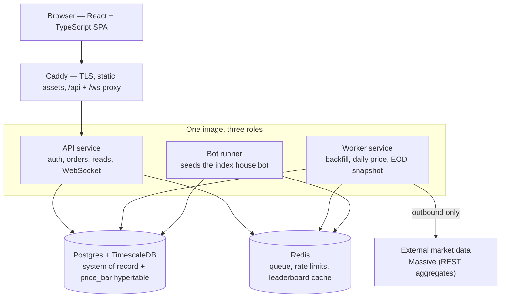

<p align="center">
  
</p>

# tickr
> 🌐 **Landing page:** a richer HTML overview lives at
> [`docs/index.html`](docs/index.html). Enable GitHub Pages (deploy from branch
> → `/docs`) to publish it at `https://kgheacock.github.io/tickr/`.

---

## Architecture

One Docker image ships three roles (`api`, `worker`, `bot`); a `ROLE` env var
selects which loop runs. The whole stack runs on a single VPS via Docker Compose.



- **Caddy** terminates TLS, serves the SPA, and proxies `/api` + `/ws`.
- **API** is stateless HTTP + WebSocket: auth/sessions, order submission,
  portfolio and leaderboard reads. It never calls market data on the request path.
- **Worker** owns all scheduled work and the external API keys: the one-time
  historical backfill, the daily post-close price update, and the daily
  valuation snapshot.
- **Bot runner** seeds the single `index` buy-and-hold bot once, at startup.
- **Postgres + TimescaleDB** is the system of record _and_ the OHLCV price store —
  all in-game pricing is served from here, never from a live quote on the hot path.
- **Redis** handles the job queue, market-data rate-limit token buckets, and the
  leaderboard read cache.


## Tech stack

| Layer            | Choice                                                                      |
| ---------------- | --------------------------------------------------------------------------- |
| **Language**     | TypeScript everywhere (Node 22)                                             |
| **Backend**      | Fastify 5, `@fastify/cookie`; realtime over a low-level `ws` gateway        |
| **Data**         | PostgreSQL + TimescaleDB extension; Redis (ioredis)                         |
| **Auth**         | Google OIDC + GitHub OAuth2 (PKCE) via `openid-client` v6, cookie sessions  |
| **Trading math** | `decimal.js` for money; integer cents on the wire                           |
| **Market data**  | Massive REST aggregates — historical backfill + post-close session updates  |
| **Contracts**    | OpenAPI → `@tickr/shared-types`, shared by api and web; `zod` at runtime    |
| **Frontend**     | React + Vite + TypeScript, CSS Modules, TradingView Lightweight Charts      |
| **Infra**        | Docker Compose, Caddy (auto-TLS), single Hetzner VPS                        |
| **Tooling**      | pnpm workspaces, ESLint + Prettier, Vitest + Testcontainers, Playwright e2e |

---

## Quick start

```bash
pnpm install
pnpm run dev        # builds images and brings up the full Compose stack
```

This starts Postgres + TimescaleDB, Redis, the three app roles, and Caddy, and
serves the app over HTTPS at `https://local.tickr.keithheacock.com`. Health check:

```bash
curl -s https://local.tickr.keithheacock.com/api/v1/health   # → {"ok":true}
```

First-run host setup (one `/etc/hosts` entry, trusting Caddy's local CA, and
filling in OAuth + market-data keys) lives in
[`CONTRIBUTING.md`](CONTRIBUTING.md).

<!-- TODO: Once TODO/12-deployment.md lands, add a deployment / hosting section
     here — production URL, sizing, monitoring, and load-testing notes drawn from
     its findings. -->
> **Hosting & deployment:** production runs the same Compose stack on a single
> Hetzner VPS behind Caddy-issued TLS. Detailed sizing, monitoring, and
> load-testing notes will be filled in from
> [`TODO/12-deployment.md`](TODO/12-deployment.md) once that slice ships.

---

## Project layout

```
apps/
  api/              # backend — runs as api | worker | bot via ROLE
  web/              # React + Vite SPA
packages/
  shared-types/     # OpenAPI doc + generated TS types shared across the wire
compose/            # docker-compose + Caddyfile
scripts/            # dev-up, backfill, deploy, backup helpers
docs/               # design documents (the source of truth for what tickr is)
```

The [`docs/`](docs/) directory is the deep dive: architecture, data model, API
surface, game mechanics, auth, and deployment.

---

## Contributing

Local setup, the test suite, code style, and the implementation playbooks live in
[`CONTRIBUTING.md`](CONTRIBUTING.md) and [`TODO/`](TODO/). This README is the
quick take; that's the workshop.
